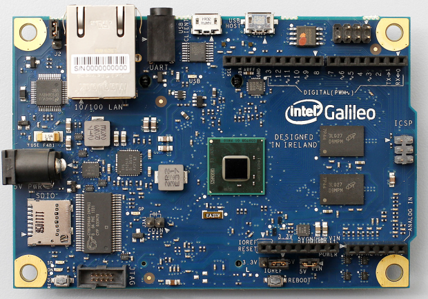
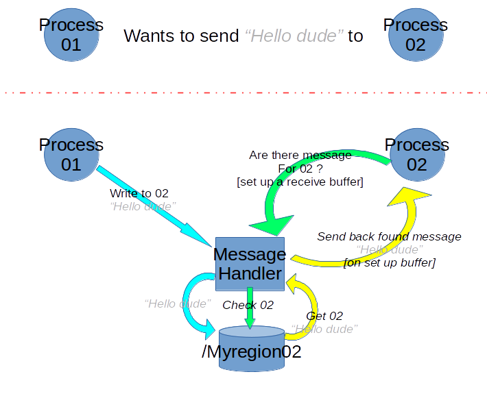
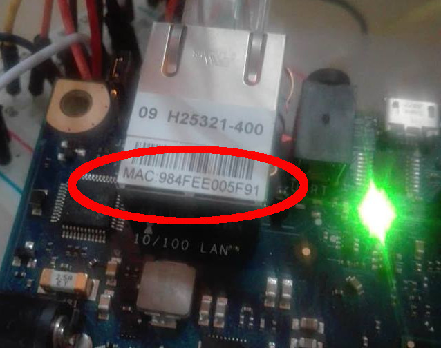
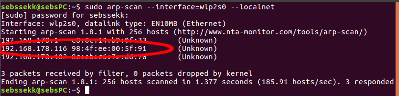
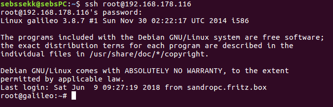
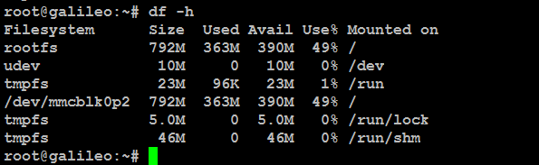
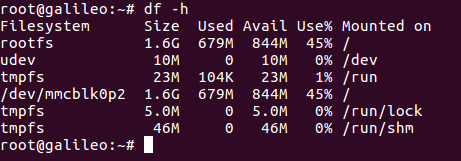
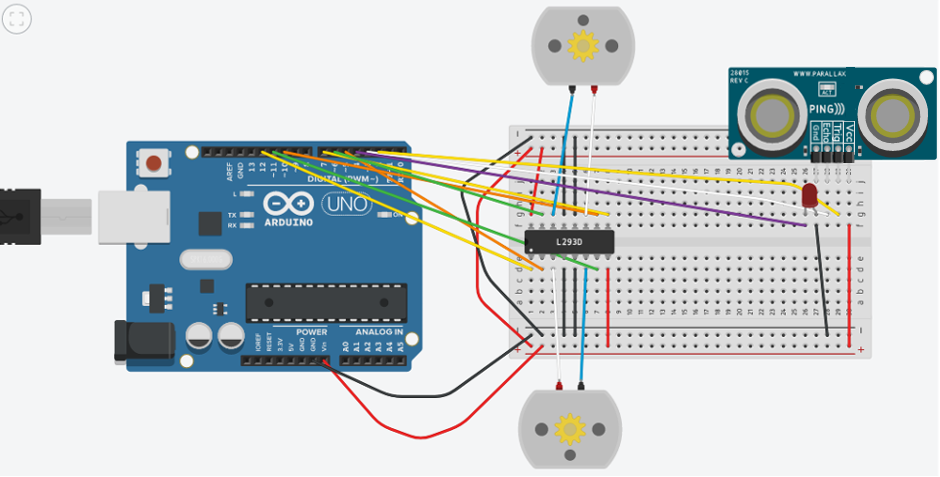
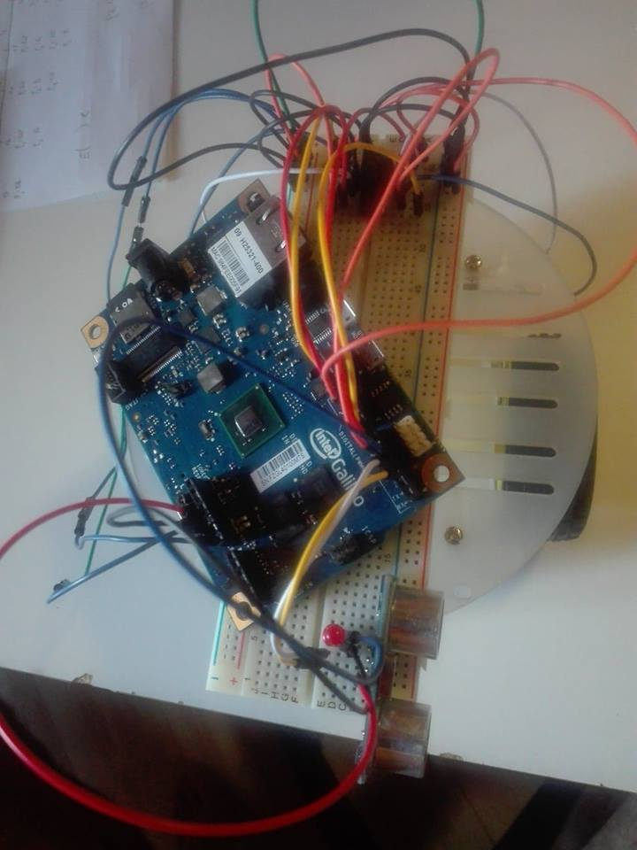
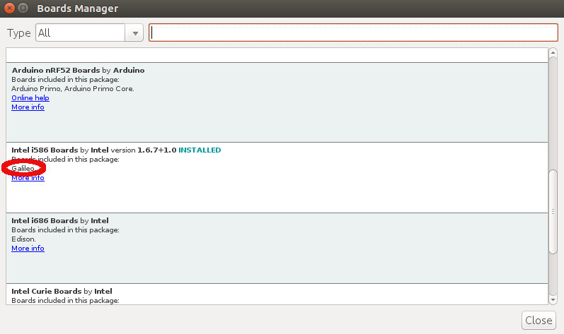

# __Inter Process Comunication between Arduino sketches on a Intel® Galileo Board__

## __The Project__
The aim of this project, as described by title, is to set up an IPC in order to let more Arduino sketches communicate. The selected board to host this work is a _Galileo Gen1_ from __Intel®__     



## __IPC Idea__
In This Repository is also stored [this](IPC_C_Code "C Code directory") directory where it's possible to find the starting IPC code (in plain C).  
I didn't want a node of the project (I mean one of the Arduino Sketches) could directly access to shared memory space, that's why I implemented a [Message Handler](IPC_C_Code/Message_Handler.c "Message Handler"). Each node can make a system call to the Message Handler who'll answer it according to passed parameters.

- __To write__ (check [here](IPC_C_Code/NodoWR.c "Writer Node")) a node calls the Handler with 2 arguments, the name of target memory space and what to write in  
  ``````C
system(./Message_Handler target_WR foo )

  ``````
- __To Read__ (check [here](IPC_C_Code/NodoRD.c "Reader Node")) a node calls the Handler with 1 arguments, the name of memory it wants to read, than _receive_ a message from Handler with asked data  
  ``````C
 system(./Message_Handler target_RD )

  ``````

#### Message Handler
[Message_Handler.c](IPC_C_Code/Message_Handler.c "Message Handler") is the file who does the dirty job. It accesses (or creates) the shared memory when called to modify or read it.  
To implement this I decided to use [Posix](https://en.wikipedia.org/wiki/C_POSIX_library "Wikipedia link") Library.  
- __sys/mman.h__ to create/open ( _shm open_ ) the shared memory region  
  ``````C
  typedef struct shared_data {
      int var1;
  } shared_data;

  char SHMOBJ_PATH[15];
  strcpy(SHMOBJ_PATH,"/myregion");
  strcat(SHMOBJ_PATH,argv[1]);//the first passed arg is the target
  int shmfd; //frame descriptor
  int shared_seg_size = (1 * sizeof(shared_data));   /* want shared segment capable of storing 1 message */
  shared_data* shared_msg; /* the shared segment, and head of the messages list */

  /* creating the shared memory object    --  shm_open()  */

  shmfd = shm_open(SHMOBJ_PATH, O_CREAT | O_RDWR, S_IRWXU | S_IRWXG);
  if (shmfd < 0)
  {
    perror("In shm_open()");
    exit(1);
  }
  fprintf(stderr, "Created shared memory object %s\n", SHMOBJ_PATH);

  /* adjusting mapped file size (make room for the whole segment to map)      --  ftruncate() */

  ftruncate(shmfd, shared_seg_size);

  /* requesting the shared segment    --  mmap() */

  shared_msg = (shared_data*)mmap(NULL, shared_seg_size, PROT_READ | PROT_WRITE, MAP_SHARED, shmfd, 0);

  ``````
- __semaphore.h__ to set up ( _sem open_ ) semaphores, to access shared memory  
  ``````C
  char SEM_PATH[15];
  strcat(SEM_PATH,"/mysem");
  strcat(SEM_PATH,argv[1]); //a sem for each region
  sem_id=sem_open(SEM_PATH, O_CREAT, S_IRUSR | S_IWUSR, 1);

  ``````  
- __mqueue.h__ to create/open ( _mq open_ ) a sender-receiver buffer  
  ``````C
  mqd_t mqd;
  struct mq_attr attr = {.mq_maxmsg = 10, .mq_msgsize = 50};
  char QUE_PATH[15];
  strcpy(QUE_PATH,"/queue");
  strcat(QUE_PATH,argv[1]);
  /*Created shared queue object QUE_PATH */
  if ((mqd = mq_open(QUE_PATH, O_CREAT | O_RDWR, 0666, &attr)) == -1)
  {
      perror("mq_open");
      exit(1);
  }

  ``````   

Once everything is set up the Handler will access to _write_ if called with 2 arguments ( I add the possibility to clean everything if the second argument is 'd' )
``````C
if (argc >2)
{
  if (*argv[2]=='d')
  {
    printf("Clean up..\n" );
    clean_up(1,SHMOBJ_PATH,SEM_PATH);
    return -1;
  }
  else
  {
    sem_wait(sem_id);

    shared_msg->var1 = atoi(argv[2]);
    printf("I'm Message_Handler and i should have allocated : %d\n",atoi(argv[2]) );

    sem_post(sem_id);
  }
}
``````
or to _read and send back_ if called with 1 arguments
``````C
char buffer[attr.mq_msgsize];
char msg[10];
int prio = rand () % 3;
itostr(shared_msg->var1,msg);
strncpy (buffer, msg, sizeof(buffer));

if (mq_send(mqd, buffer, sizeof(buffer), prio) == -1)
{
    perror("mq_send");
    exit(1);
}
``````
(An easy image to explain how it works)


## __Set up the Galileo Board__
Once the IPC idea is clear it's time to set up the board.  
### Debian image
It's possible to make an Operative System run on Galileo thanks to an micro SD card. A Linux Debian distro is aviable for this Hardware [here](https://sourceforge.net/projects/galileodebian/files/ "Debian Galileo"), and I decided to use it on a 2GB microSD card.  
In order to do it you should fallow these step
- __Formatting SD card__   
  On Linux you can easily do it with disks manager (or using Windows you can use dedicated program such as SDFormatter)  

- __Writing Debian Image on SD card__  
  On _Linux_ you can do it by write on prompt  
  ``````bash
  sudo dd if=sdcard.img of=/dev/sdb

  ``````
  On _Windows_ again you can download a dedicated program such as Rawrite32  

Now it's finally possible to access to Galileo Board, inserting the Debian SD card in our board and plugging an ethernet cable. Actually it will possible control the Galileo thanks to an SSH link  
### SSH Board Connection
On a Linux PC (on same network of Galileo) I run _arp-scan_  
( the --interface field can be different according your kind of connection, check with `ifconfig` command )  
``````bash
sudo arp-scan --interface=wlp2s0 --localnet

``````
This command allow me to detect every devices attached to my connection and their local IP address. With board's MAC address I can easily find witch local IP address was associated to Galileo.



Now I've an IP address I can refer to, it's time to set up an SSH connection prompting fallowing command
``````bash
ssh root@192.168.178.116

``````
Giving the password "_root_ "


### Expanding the filesystem
Now from Galileo board the last step is to resize the partition in order to use all the space of SD card (as at this point just 900MB are dedicated to Linux Debian)



_Parted_ is a programm that allow to destroy,resize and move partition. That's what needed now.  
First select and resize partition with  
``````bash
parted /dev/mmcblk0 resizepart 2

``````
giving the amount of space we want.  
Here `reboot` is needed.  
Once the partition has been resized, we create a journal inode prompting
``````bash
tune2fs -j /dev/mmcblk0p2

``````
and `reboot` again.  
The last step is to expanding the file system up to partition size With
``````bash
resize2fs /dev/mmcblk0p2

``````
to be able to fully use our SD card



## __Arduino Setches upload__
Now that the board is ready and easily accessible it's finally time to upload Arduino Sketches who implement this IPC (making some changes to .c files we discussed at the beginning).  
### Sketches aim
The main target of this project is the IPC, yet to simulate a real application each Arduino Sketch has its own simple aim.
-  [__nodoWR_sensor.ino__](nodoWR_sensor.cpp "sensor Sketch code") it's a sketch who control an [ultrasonic module HC-SR04](https://cdn.sparkfun.com/datasheets/Sensors/Proximity/HCSR04.pdf). Its measurements will be send to a shared memory calling the Message Handler with `_sensor` as first argument and the measurement as second one.

- [__nodoRD_led.ino__](noodRD_led.cpp "led Sketch code") it's a sketch who control a [red led](https://www.exploringarduino.com/parts/red-led/). It calls the Message Handler to receive data from `_sensor` shared memory. If this value is < 20cm it swith the led on.
- [__nodoRD_motor.ino__](nodoRD_motor.cpp "motors Sketch code") it's a sketch who control the motors of the [Robot Car Chassis for Arduino](https://www.ebay.com/p/1set-2wd-Mini-DIY-Kit-Round-Double-deck-Smart-Robot-Car-Chassis-for-Arduino/2145354338?iid=182070721182&_trkparms=aid%3D555018%26algo%3DPL.SIM%26ao%3D2%26asc%3D52569%26meid%3D1260d361bc8448fcbd80d2d70ab0b2ff%26pid%3D100005%26rk%3D4%26rkt%3D12%26sd%3D182106082960%26itm%3D182070721182&_trksid=p2047675.c100005.m1851). It calls the Message Handler to receive data from `_sensor` shared memory. If this value is < 20cm the robot goes backward else it keeps on going forward.


(In this image is rappresented the circuit for this project with an Arduino board, yet I uses a Galileo board as you can see)


## Upload and Compile
With a simple Arduino sketch uploaded on a Arduino board this work it's done by __Arduino IDE__. Here it __cannot__ for 2 reasons:  
- As the project required implementation of Posix library, it should be added the `-lrt` option while compiling. Unfortunately Arduino IDE doesn't allow you to give option to compilation.

- As we are using a Linux Debian image every uploading by Arduino IDE ends up with a login error (since it doesn't give the Debian password).

My solution, as I wanted to keep the Arduino interface was the fallowing.

## On Board Compiling and _scons_
As title says I decided to compile Sketches on Galileo itself
- __SSH .cpp upload__  
  First of all I converted `.ino` files in `.cpp` adding at the beginning
  ``````C++
  #include <Arduino.h>

  ``````
  and than with the command `scp` (for copying file on ssh connection) I copied them all in the Galileo at `~/arduino/`

- __SCons__  
  [_scons_](https://scons.org/ "scons.org") is an auto-make file who let you generate executable file from source (giving it right options and libraries paths). It's a python package and it can be easily installed by prompting
  ``````bash
  pip install SCons

  ``````  

## Building SConstruct files
The last step to compile our `.ino` files is to write a `SConstruct` file. Actually Scons (when called) looks for a file named SConstruct where you can specify every compiling options and libraries. But where to find these informations?  
Thanks to [__Arduino IDE__](https://www.arduino.cc/en/Main/Software)

- __Galileo Extension__  
  As a first thing we should add the extension for Intel board Compiling selecting it in the upper menu at `tools > board > Boards manager...`
  

- __Galileo Compiling logs__  
  Going on `File > preference` and enabling “Show verbose output during: compilation” it's possible to visualize every compiling information, and especially all G++ options and where to find `Hardware` libraries. Now we just to click on _verify_ button on an example sketch to find out everything. In my case I found _hardware_ folder at `~/.arduino15/packages/Intel/hardware`  
  Finally when I have find out the _hardware_ folder I copied it on Galileo inside `~/arduino/` directory.   

- __Set the SConstruct file__  
  Last thing to do is set corect paths inside [SConstruct](SConstruct "SConstruct template") file for includes and libraries.  
  Modifing last line (giving our .cpp files and any options we want)
 ```Python
  env.Program(‘sketch.elf’, [ c/c++ files here, ‘libcore.a’], CCFLAGS=output, LIBS=[‘pthread’, ‘rt’])
```
  and running from current folder `scons` we can finally have a file `.elf`, as the Arduino Standard, ready to be run .

## Conclusion
Thanks to this we are able to keep an easy Arduino interface to write code, but on a powerful board, with a full Linux image, and without limitation.

__Remember__ that to run these `.elf` files we must give them 2 arguments such as
```bash
./Sketch.elf foo bar
```
As defined in __main.cpp__ at _core_ folder (where you find all the implementation of Arduino functions, deep in _hardware_ folder)
```C
// debug for the user
        if (argc < 2){
                fprintf(stderr, "./sketch tty0\n");
                return -1;
        }

```

## Hardware Issue with HC-SR04
It must be underlined that the Ultrasonic sensor hc-sr04 __doesn't__ work on Galielo board, not at the same simple way it works on Arduino. Actually Galileo pins can't read ultrasonic sensor frequency.  
Yet there are 2 pins, pin2 and pin3 that have an higher frequency, who let them catch the ultrasonic sensor answer. To abilitate this functionality we have to tell it to Galileo with different function from _Newping_ module:  
when they are set up
```C
pinMode(trig, OUTPUT_FAST);
pinMode(echo, INPUT_FAST);
```
and when they are utilized
```C
 fastDigitalWrite(trig, LOW);
 delayMicroseconds(2);
//Sending a high pulse to trigger the Ultrasound Module
 fastDigitalWrite(trig, HIGH);
 delayMicroseconds(10); // tringging for 10 us

 fastDigitalWrite(trig, LOW)
 //Calculating the distance
 // Speed sound is 340 m/s or 29 microseconds per cm
 // so distance is pulseIn/29.0 to get how many cm and than /2 (go and back)
 distance=pulseIn(echo,HIGH)/58.0;

```

## Run the whole job
Last thing to do is to set up a script who run all sketches as a multi thread application. That's what [Start.cpp](Start.cpp "Start.cpp code") does. Prompting on Galileo
```bash
~/arduino/Start
```
Everything starts working untill an interrupt signal is send ( ^C )


